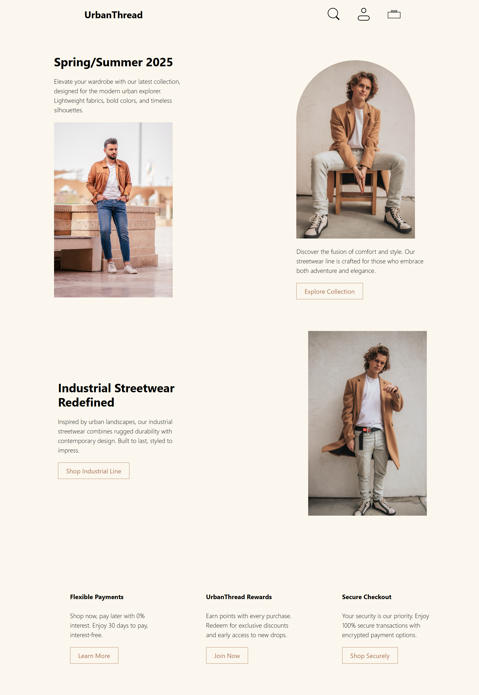

UrbanThread – Landing Page

A simple one-page landing design for a modern streetwear brand.
Built with HTML5 and Tailwind CSS (via CDN), it features a clean layout showcasing collections, product highlights, and brand perks.

🚀 Features

Responsive navigation bar with logo and icons

Hero section for the Spring/Summer 2025 collection

Product highlight sections with text + imagery

Simple footer with brand perks (payments, rewards, security)

Clean, minimal design optimized for all devices

🛠️ Tech Used

HTML5

Tailwind CSS (CDN version, no build process required)

📷 ScreenShot 

🎨 Customization

Replace images inside /Images/ with your own.

Edit text content directly in index.html.

Update Tailwind classes for different colors, spacing, or layout.

📜 License

Free to use for personal or educational projects.
